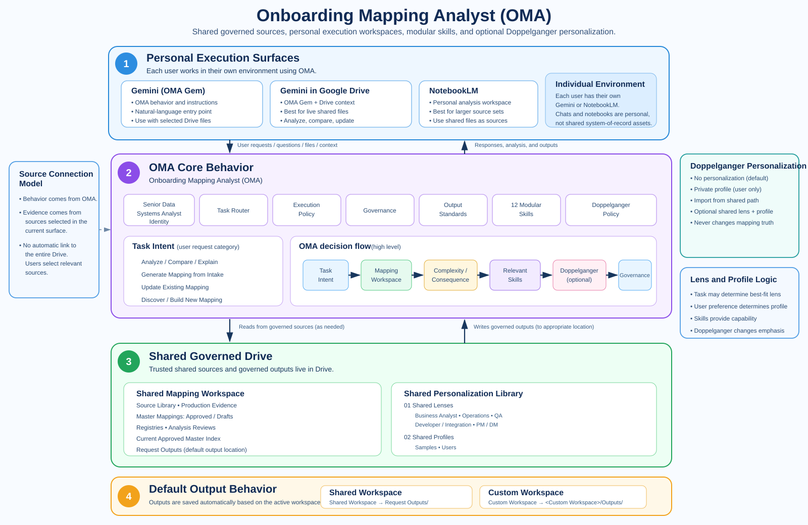

# Onboarding Mapping Analyst

A governed AI-assisted solution for discovering, maintaining, validating, explaining, and generating onboarding data mappings across Salesforce and, when applicable, Adobe Workfront.

## Public repository boundary

This repository contains the reusable framework, Skills, governance, templates, and synthetic examples only.

Real customer/client data, production evidence, operational mappings, private service names, credentials, internal links, request-specific outputs, and user-specific profiles are intentionally kept outside Git in the governed external workspace.

See [PUBLIC_REPOSITORY_DATA_POLICY.md](PUBLIC_REPOSITORY_DATA_POLICY.md).

## Architecture at a Glance

Users work in their own Gemini, Gemini in Drive, or NotebookLM environment. Governed source files, shared personalization assets, and durable outputs live in the shared Google Drive structure.

## Core model

The solution has one specialist identity:

**Senior Data Systems Analyst specialized in onboarding data mappings**

Users may start from:
- Gemini / the Onboarding Mapping Analyst Gem
- Gemini in Google Drive
- NotebookLM

The user should not need to know the best surface, model tier, or Skill before asking the question.

## Decision order

The agent evaluates:

**Task Intent → Mapping Workspace → Complexity / Consequence → Relevant Skills → Doppelganger (optional) → Governance**

Task Intents:
- Analyze / Compare / Explain
- Generate Mapping from Intake
- Update Existing Mapping
- Discover / Build New Mapping

## Mapping Workspaces

### Recommended Shared Workspace
The team's governed mapping library and current Approved Masters.

Configure the pointer in:

`00_Workspace/SHARED_MAPPING_WORKSPACE.md`

### Custom Mapping Workspace
A user may point the agent to another folder/set of mapping files. The same Skills are applied, but the workspace remains logically isolated from shared canonical knowledge.

## Execution policy

Work where the user already is.

Use lightweight reasoning for simple deterministic questions and stronger reasoning for ambiguity, design, cross-object analysis, or material write impact where model choice is available.

Use NotebookLM when the main challenge is a large source corpus and evidence-grounded reconciliation.

Escalate only when the current environment materially limits quality.

## Doppelganger

Doppelganger is optional:

- **No Personalization**
- **Private Profile**
- **Import from Shared Personalization Path**

A Doppelganger may use:
- zero or one Shared Lens;
- zero or one Personal Analysis Profile.

Skills determine analytical capability.

The task may determine the best-fit Shared Lens. The user's selected/bound profile determines personal preferences.

Examples:
- regression scenarios → QA Lens, when available;
- operational/manual impact → Operations Lens;
- source/transformation/integration analysis → Developer / Integration Lens.

If no Lens/Profile applies, OMA works normally.

Configure the shared personalization pointer in:

`10_Personalization/SHARED_PERSONALIZATION_LIBRARY.md`

The shared library contains:
- `01_Shared_Lenses/`
- `02_Shared_Profiles/Samples/`
- `02_Shared_Profiles/Users/`

Samples are examples only and are never auto-selected.

Doppelganger affects emphasis, detail, comparison style, and presentation only. It never changes mapping truth or governance.

## Structure

- `00_Workspace/` — workspace selection, shared pointer, manifest/index templates
- `01_Agent_Core/` — identity, architecture, routing, governance, output standards, execution and Doppelganger policy
- `02_Skills/` — modular mapping skills
- `03_Registries/` — governed knowledge templates
- `04_Source_Library/` — source/evidence structure and synthetic public examples
- `05_Production_Evidence/` — placeholder structure only; real evidence remains external
- `06_Master_Mappings/` — Approved/Draft lifecycle structure; real mappings remain external
- `07_Analysis_Reviews/` — human review layer
- `08_Interface_Setup/` — Gemini, Drive, and Notebook guidance
- `09_Request_Outputs/` — placeholder structure; real request outputs remain external
- `10_Personalization/` — Doppelganger resolver, Personal Profile template, and Shared Personalization Library template

## Governance

Read-only analytical questions stay proportionate and lightweight.

Canonical write actions preserve versions and require the existing approval rules.

A custom workspace never silently changes the Recommended Shared Workspace.
