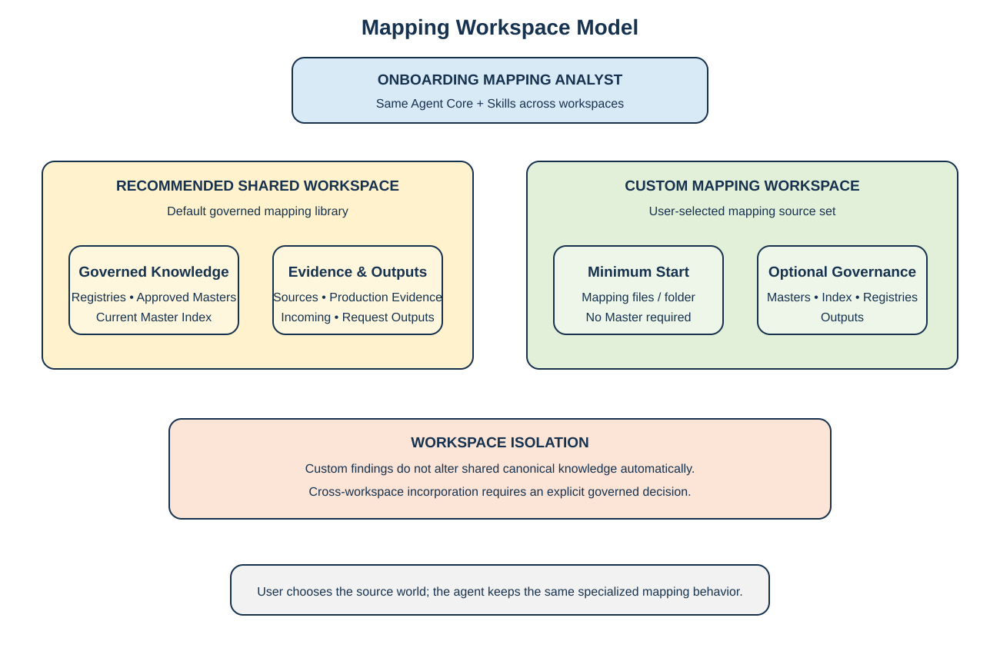
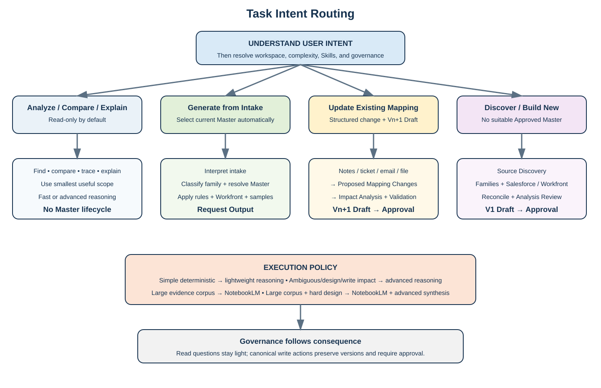

# ONBOARDING MAPPING ANALYST
## Solution Overview & User Guide

*AI-assisted analysis, discovery, maintenance, and generation of onboarding mappings for Salesforce and, when applicable, Adobe Workfront.*


> **Start here**
> The diagram shows the complete operating model before any workspace or AI-surface setup: personal execution at the top, OMA behavior in the middle, shared governed Drive below, and automatic output routing at the bottom.

| ANALYZE | GENERATE | EVOLVE |
|---|---|---|
| Explain fields, compare mappings, trace lineage, and investigate differences without unnecessary process. | Interpret an intake and automatically use the appropriate current Master to create the request-specific mapping. | Discover new mapping models or safely apply changes from requirements, meeting notes, tickets, or new evidence. |

# 1. Solution Overview

## One specialist behavior, wherever the user starts

The Onboarding Mapping Analyst acts as a **Senior Data Systems Analyst specialized in onboarding data mappings**, using strong Business Analysis and Data Analysis practices.

Users may start from:
- Gemini / the Onboarding Mapping Analyst Gem;
- Gemini in Google Drive;
- their own Gemini Notebook / NotebookLM workspace.

Each user works in their own AI surface. The shared layer is the governed Google Drive structure that provides mapping inputs, shared knowledge, personalization assets, and output destinations.

The user does not need to know the best Skill or workflow before asking the question.

The solution follows:

**Task Intent → Mapping Workspace → Complexity / Consequence → Relevant Skills → Doppelganger (optional) → Governance**

> **Core principle**
> Work where the user already is. Use the strongest appropriate capability available there. Escalate only when the current environment would materially reduce analysis quality.

## What the agent can understand

| Task Intent | Typical request | Result |
|---|---|---|
| Analyze / Compare / Explain | “Why is this field different?”, “Where does this value come from?”, “Compare these two mappings.” | Focused read-only answer or analysis. |
| Generate Mapping from Intake | User supplies onboarding/intake data. | Appropriate mapping family and Current Approved Master are selected automatically; request mapping is generated. |
| Update Existing Mapping | “Apply these meeting notes / changes to the mapping.” | Proposed changes are structured, impact is analyzed, and the next Draft version is created. |
| Discover / Build New Mapping | New source set does not fit the current model. | Independent discovery, candidate families, Analysis Review, then V1 lifecycle. |

# 2. Architecture & Mapping Workspace

## Personal execution, shared governed files

The AI execution surface is personal to each user. Gemini, Gemini in Drive, and NotebookLM are workspaces where the user performs the analysis.

The durable shared layer is Google Drive.

**Personal execution surfaces**
- Gemini / OMA Gem;
- Gemini in Drive;
- the user's own NotebookLM notebook.

**Shared governed Drive**
- mapping sources and historical evidence;
- Current Approved Masters and registries;
- Shared Lenses and intentionally shared profiles;
- request outputs and governed analysis artifacts.

The notebook or chat is not the system of record. Useful results become durable only when they are written to the appropriate shared workspace location.

## Mapping Workspace

A Mapping Workspace defines the source world for the current task.

### Recommended Shared Workspace

The team's governed mapping library, including current Approved Masters, registries, source/evidence files, shared personalization assets, and default output locations.

**[SHARED_MAPPING_WORKSPACE_LINK]**

### Custom Mapping Workspace

A user may point the agent to another mapping folder or source set. The same analyst role and Skills apply, but findings remain isolated from the Recommended Shared Workspace unless explicitly incorporated through governance.



## Doppelganger

The same shared Mapping Skills are used by everyone. An optional **Role Lens** or **Personal Analysis Profile** can tailor analysis emphasis, detail, comparison format, and presentation.

Users can choose:
- **No Personalization**
- **Private Profile**
- **Import from Shared Personalization Path**

A Doppelganger may combine one Role Lens plus one Personal Analysis Profile. Multiple Personal Profiles or multiple Role Lenses are not mixed by default.

Shared library structure:

```text
Shared_Personalization_Library/
├── 01_Shared_Lenses/
├── 02_Shared_Profiles/
│   ├── Samples/
│   └── Users/
└── DOPPELGANGER_INDEX.csv
```

Samples are examples only and are never selected automatically. Real Shared User Profiles are used only when explicitly selected or bound to that user.

**[SHARED_PERSONALIZATION_LIBRARY_PATH]**

Lens selection rule: explicit Lens choice wins. Otherwise, when the task strongly and unambiguously matches one professional perspective, use that Shared Lens. For a neutral task, use an optional profile/default Lens when configured. If no Lens fits, use plain OMA.

Profile selection rule: use an explicitly selected/bound Personal Profile only. Never auto-select another person's Shared User Profile.

Skills provide analytical capability. The task may determine the best-fit Lens; the Personal Profile controls how that person prefers to consume the result.

Doppelganger never changes mapping evidence, Approved Masters, canonical rules, validation, or approval requirements.

## Surface-aware execution

The solution works where the user already is.

| Need | Preferred surface behavior |
|---|---|
| Simple lookup / focused comparison / field location | Stay in the current Gemini or Drive surface when it can answer reliably. |
| Many files / historical corpus / evidence-heavy reconciliation | Use the user's NotebookLM workspace with the relevant Drive sources loaded. |
| Governed mapping generation or update | Use the active surface, but persist the resulting artifact to the Mapping Workspace output location. |
| Current surface lacks required sources or context | Add/select the required shared Drive sources or move the analysis to NotebookLM when appropriate. |

The user should not have to switch tools for routine work.

# 3. Task Routing & Governance



## Analyze / Compare / Explain

Keep small questions small.

Examples include:
- compare two files;
- locate a field;
- explain a transformation/default;
- identify why one onboarding type differs;
- trace lineage;
- compare versions.

This is read-only unless the user explicitly asks for a change. No Master lifecycle is required just to answer a mapping question.

## Generate Mapping from Intake

Interpret intake → classify mapping family → resolve Current Approved Master → apply conditions/rules → populate request values → determine Workfront applicability → validate → generate request-specific mapping.

The user does not choose the Master manually.

## Update Existing Mapping

Change input may arrive as:
- explicit change list;
- meeting notes;
- SME comments;
- email/Jira/request text;
- another mapping file;
- implementation findings.

The agent first converts the input into **Proposed Mapping Changes**, then compares current vs proposed behavior, performs impact analysis, and creates Vn+1 Draft.

Approved Masters are never edited in place.

### Versioning model

OMA uses two complementary layers:

| Layer | Purpose |
|---|---|
| Google native file history | Tracks normal working edits, recovery, and edit-level history while a Master is still a Draft. |
| OMA logical mapping versions | Tracks governed business states such as V1 Approved, V2 Draft, and V2 Approved. |

A new logical version is created for a new canonical change, not for every small Draft edit.

Example:

**V1 Approved → V2 Draft → normal edits tracked by Google history → validation → approval → V2 Approved**

Approval promotes the same logical V2 artifact when possible; it does not require a duplicate second file just to represent "Approved".

After V2 is Approved, it becomes immutable. Any later canonical change begins V3 Draft.

The **Current Approved Master Index**, not Drive modified date or Google revision history, determines the canonical current version.

## Discover / Build New Mapping

Use when no Approved Master exists or the source set does not reasonably match existing mapping families.

Independent discovery → Mapping Family Discovery → Salesforce / Workfront analysis → reconciliation → Analysis Review → V1 Draft → explicit approval.

## Approval channel

OMA supports approval intent inside the AI workspace, but the governed approval is finalized in the mapping file.

If an authorized user says **"I approve"** in Gemini, Gemini in Drive, or NotebookLM:

1. OMA records the approval intent;
2. the mapping remains **READY_FOR_APPROVAL**;
3. OMA tells the user to complete approval in the file;
4. the file approval event triggers the downstream governance workflow;
5. only then is the logical version promoted to **APPROVED**, the Current Approved Master Index updated, and downstream notifications/actions executed.

This prevents the solution from becoming dependent on one conversation while still allowing natural approval language inside the AI surface.

**Mandatory OMA response**

Whenever a user asks for approval, says they approve, or asks OMA to mark/promote a mapping as Approved, OMA must display:

> Approval intent recorded. Final governed approval must still be completed in the mapping file. The file approval is the authoritative trigger for promotion and the downstream approval workflow.

Conversational approval is intentionally lightweight. It exists only to capture approval intent, prepare the approval summary/rationale, and direct the user to the authoritative file approval. It is not a second governed approval channel.

## Governance is proportional

| Situation | Governance |
|---|---|
| Read-only analysis | Evidence-based answer at the smallest useful scope. |
| Request-specific generation | Validate against the Current Approved Master; output remains non-canonical. |
| Master update | Versioned Draft + impact analysis + READY_FOR_APPROVAL + final file approval. |
| New Master | Full discovery / Analysis Review + READY_FOR_APPROVAL + final file approval. |

# 4. How to Use the Agent

## Start with the ZIP

| Step | What to do |
|---|---|
| 1. Unzip | Keep the supplied structure intact. It contains the analyst behavior, Skills, templates, and workspace guidance. |
| 2. Start where you already work | Gemini, Gemini in Drive, or your own NotebookLM workspace are valid entry points. |
| 3. Connect the task to shared sources | Select/import the relevant files from the Recommended Shared Workspace, or provide another mapping folder/files for a Custom Workspace. |
| 4. Doppelganger | Choose No Personalization, Private Profile, or Import from Shared Personalization Path. |
| 5. Ask naturally | The agent infers the Task Intent and does not require Skill names. |
| 6. Review only when needed | Read-only questions remain lightweight; Master creation/changes use the governed lifecycle. |
| 7. Output | Recommended Shared Workspace → default Request Outputs. Custom Workspace → its Outputs area when writable. The user may override the destination when supported. |

## Examples

| User asks | Agent interprets |
|---|---|
| “Which mapping has this field?” | Analyze / Compare / Explain, lightweight lookup. |
| “Why does Pension create this Asset differently?” | Analyze / Compare / Explain, deeper reasoning if required. |
| “Here is the intake. Generate the mapping.” | Generate Mapping from Intake and select the correct Current Approved Master. |
| “Apply these meeting notes to the current mapping.” | Update Existing Mapping; extract structured changes before editing anything. |
| “Analyze these 40 historical mappings and discover the reusable model.” | Discover / Build New Mapping; deep corpus analysis is appropriate. |
| “These files seem unrelated to our existing families.” | Investigate as a potential new Custom Mapping Workspace / new family. |

> **NotebookLM**
> Each user may use their own notebook. Load the relevant shared Drive files as notebook sources for deep-corpus analysis. The notebook itself is not the shared repository; final governed outputs use the Mapping Workspace destination.

> **When the agent is uncertain**
> Use UNKNOWN, CONFLICT, OBSERVED DIFFERENCE, MISSING MAPPING, or CLARIFICATION REQUIRED rather than turning uncertainty into a rule.

### Promote to Knowledge

When a discussion produces a reusable validated decision, clarification, mapping rule, change rationale, or learning, the user can ask OMA to **Promote to Knowledge**.

OMA follows:

**Discussion → Distill → Classify → Validate → Persist**

The conversation itself is working context. OMA persists the validated outcome into the appropriate governed Drive artifact or registry rather than storing the raw chat as canonical knowledge.

This action is available conceptually across Gemini / OMA Gem, Gemini in Drive, and NotebookLM. Surface mechanics may differ, but the durable destination remains the governed Mapping Workspace.

NotebookLM can consume promoted Drive artifacts as sources. OMA does not assume that a new artifact is automatically enrolled into every user's notebook.

# 5. Skills & Operating Model

Skills are **analytical lenses and quality gates**, not rigid scripts. The analyst reasons first and applies the Skills needed to make the result complete and reliable.

In Confluence, they can be displayed with Tabs: **Discover | Analyze | Deliver | Govern**.

| Stage | Skills | Purpose |
|---|---|---|
| Discover | Source Discovery & Classification; Mapping Family Discovery | Understand unfamiliar source sets and discover reusable families. |
| Analyze | Salesforce Objects Analysis; Workfront Mapping Analysis; Field Reconciliation; Canonical Mapping Analysis; Gap/Conflict/Clarification Analysis | Investigate system behavior and reconcile evidence. |
| Deliver | Master Mapping Generation; Change & Impact Analysis; Request Mapping Generation | Generate request outputs or controlled Draft Masters. |
| Govern | Validation & QA; Learning & Knowledge Curation | Validate traceability and persist only approved/validated learning. |

## Doppelganger model

**Shared Skills** define how mapping analysis is performed.  
**Role Lenses** define what matters most to a role.  
**Personal Profiles** refine individual preferences.  
**Doppelganger** resolves which Role Lens and/or Personal Profile is active. A task may select the best-fit Lens, while the user's profile refines personal preferences.

A repeated useful preference can become a Profile Update Candidate, but the agent must ask before persisting it. Personal profiles are private by default and may be explicitly published to the shared personalization library.

## Operating principles

- **Reason before routing.**
- **Work where the user is.**
- **Small read tasks stay small.**
- **Write/canonical-impact tasks receive stronger reasoning and governance.**
- **NotebookLM remains a personal deep-corpus analysis workbench; shared Drive remains the durable shared layer.**
- **Existing knowledge is context, not a predetermined conclusion.**
- **Custom workspaces never silently change shared canonical knowledge.**

> **Success looks like this**
> The user can ask a simple field question, submit an intake, provide meeting notes that imply mapping changes, or drop a large historical mapping set into NotebookLM, and the same specialist analyst behavior selects the appropriate depth, Skills, Master, and governance automatically.
